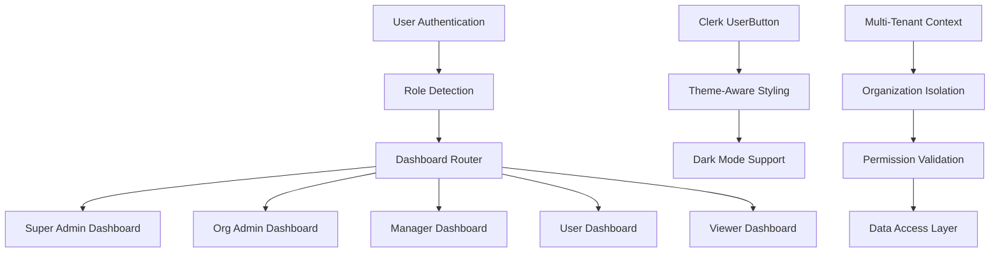
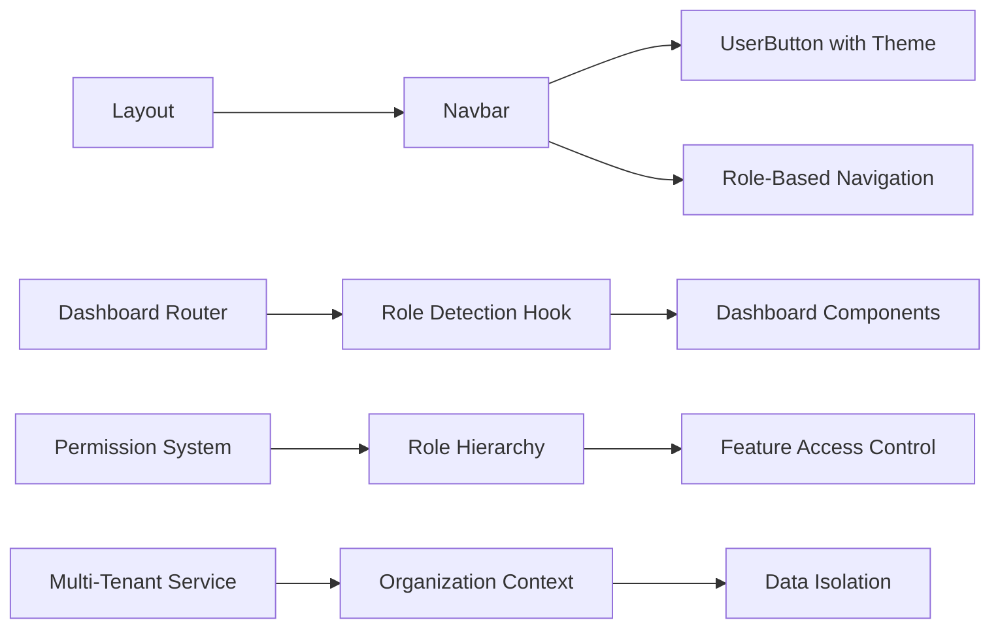

# Design Document

## Overview

This design document outlines the implementation of a comprehensive role-based dashboard system for Docify.ai Pro. The system addresses the dark mode visibility issue with Clerk UserButton and implements proper role-based navigation and dashboards as specified in the PRD and BRD documents. The solution ensures proper multi-tenant data isolation while providing tailored experiences for each user role.

## Architecture

### High-Level Architecture



### Component Architecture



## Components and Interfaces

### 1. Enhanced Clerk UserButton Configuration

#### Theme-Aware UserButton Component
```typescript
interface ThemedUserButtonProps {
  afterSignOutUrl?: string;
  appearance?: Appearance;
}

// Enhanced Clerk configuration with proper dark mode support
const clerkAppearance: Appearance = {
  // ... existing configuration
  elements: {
    // ... existing elements
    userButtonPopoverCard: "bg-popover text-popover-foreground border border-border shadow-md",
    userButtonPopoverActionButton: "text-foreground hover:bg-accent hover:text-accent-foreground",
    userButtonPopoverActionButtonText: "text-foreground",
    userButtonPopoverFooter: "bg-popover border-t border-border",
    userButtonPopoverActionButtonIcon: "text-foreground",
  }
}
```

#### UserButton Integration
```typescript
export function ThemedUserButton({ afterSignOutUrl, appearance }: ThemedUserButtonProps) {
  const { theme } = useTheme();
  
  const enhancedAppearance = {
    ...clerkAppearance,
    ...appearance,
    elements: {
      ...clerkAppearance.elements,
      ...appearance?.elements,
    }
  };

  return (
    <UserButton 
      afterSignOutUrl={afterSignOutUrl}
      appearance={enhancedAppearance}
    />
  );
}
```

### 2. Role-Based Dashboard System

#### Dashboard Router Component
```typescript
interface DashboardRouterProps {
  user: User;
  organization: Organization;
}

export function DashboardRouter({ user, organization }: DashboardRouterProps) {
  const dashboardPath = getDashboardPathByRole(user.role);
  
  useEffect(() => {
    if (window.location.pathname === '/dashboard') {
      redirect(dashboardPath);
    }
  }, [dashboardPath]);

  return null;
}

function getDashboardPathByRole(role: Role): string {
  switch (role) {
    case Role.SUPER_ADMIN:
      return '/admin/dashboard';
    case Role.ORG_ADMIN:
      return '/dashboard/organization';
    case Role.MANAGER:
      return '/dashboard/projects';
    case Role.USER:
      return '/dashboard/docs';
    case Role.VIEWER:
      return '/dashboard/browse';
    default:
      return '/dashboard/docs';
  }
}
```

#### Role Detection Hook
```typescript
interface UserRole {
  role: Role;
  organizationId: string;
  permissions: Permission[];
  projectRoles: Record<string, ProjectMemberRole>;
}

export function useUserRole(): {
  userRole: UserRole | null;
  loading: boolean;
  error: Error | null;
} {
  const { user } = useUser();
  const [userRole, setUserRole] = useState<UserRole | null>(null);
  const [loading, setLoading] = useState(true);
  const [error, setError] = useState<Error | null>(null);

  useEffect(() => {
    if (user) {
      fetchUserRole(user.id)
        .then(setUserRole)
        .catch(setError)
        .finally(() => setLoading(false));
    }
  }, [user]);

  return { userRole, loading, error };
}
```

### 3. Dashboard Components

#### Super Admin Dashboard
```typescript
interface SuperAdminDashboardProps {
  organizations: Organization[];
  platformMetrics: PlatformMetrics;
}

export function SuperAdminDashboard({ organizations, platformMetrics }: SuperAdminDashboardProps) {
  return (
    <div className="space-y-8">
      <DashboardHeader 
        title="Platform Administration"
        description="Manage organizations, subscriptions, and platform-wide settings"
      />
      
      <div className="grid grid-cols-1 md:grid-cols-2 lg:grid-cols-4 gap-6">
        <MetricCard title="Total Organizations" value={platformMetrics.totalOrganizations} />
        <MetricCard title="Active Users" value={platformMetrics.activeUsers} />
        <MetricCard title="Monthly Revenue" value={platformMetrics.monthlyRevenue} />
        <MetricCard title="System Health" value={platformMetrics.systemHealth} />
      </div>
      
      <div className="grid grid-cols-1 lg:grid-cols-2 gap-8">
        <OrganizationManagement organizations={organizations} />
        <SubscriptionOverview />
      </div>
      
      <PlatformAnalytics />
    </div>
  );
}
```

#### Organization Admin Dashboard
```typescript
interface OrgAdminDashboardProps {
  organization: Organization;
  projects: Project[];
  teamMembers: User[];
  aiUsage: AIUsageMetrics;
}

export function OrgAdminDashboard({ organization, projects, teamMembers, aiUsage }: OrgAdminDashboardProps) {
  return (
    <div className="space-y-8">
      <DashboardHeader 
        title={`${organization.name} Administration`}
        description="Manage your organization, team, and AI-powered documentation"
      />
      
      <div className="grid grid-cols-1 md:grid-cols-2 lg:grid-cols-4 gap-6">
        <MetricCard title="Projects" value={projects.length} />
        <MetricCard title="Team Members" value={teamMembers.length} />
        <MetricCard title="AI Generations" value={aiUsage.totalGenerations} />
        <MetricCard title="Documents" value={aiUsage.totalDocuments} />
      </div>
      
      <div className="grid grid-cols-1 lg:grid-cols-3 gap-8">
        <div className="lg:col-span-2">
          <AIAssistantInterface />
        </div>
        <div>
          <TeamManagement members={teamMembers} />
        </div>
      </div>
      
      <ProjectOverview projects={projects} />
      <OrganizationAnalytics organizationId={organization.id} />
    </div>
  );
}
```

#### Manager Dashboard
```typescript
interface ManagerDashboardProps {
  user: User;
  managedProjects: Project[];
  teamMembers: User[];
}

export function ManagerDashboard({ user, managedProjects, teamMembers }: ManagerDashboardProps) {
  return (
    <div className="space-y-8">
      <DashboardHeader 
        title="Project Management"
        description="Oversee your assigned projects and coordinate team efforts"
      />
      
      <div className="grid grid-cols-1 md:grid-cols-3 gap-6">
        <MetricCard title="Managed Projects" value={managedProjects.length} />
        <MetricCard title="Team Members" value={teamMembers.length} />
        <MetricCard title="Active Tasks" value="12" />
      </div>
      
      <div className="grid grid-cols-1 lg:grid-cols-2 gap-8">
        <ProjectManagement projects={managedProjects} />
        <TeamCollaboration members={teamMembers} />
      </div>
      
      <ProjectAnalytics projects={managedProjects} />
    </div>
  );
}
```

#### User Dashboard
```typescript
interface UserDashboardProps {
  user: User;
  accessibleProjects: Project[];
  recentDocuments: Document[];
}

export function UserDashboard({ user, accessibleProjects, recentDocuments }: UserDashboardProps) {
  return (
    <div className="space-y-8">
      <DashboardHeader 
        title="Documentation Hub"
        description="Access your documents, collaborate with your team, and stay updated"
      />
      
      <div className="grid grid-cols-1 md:grid-cols-3 gap-6">
        <MetricCard title="Accessible Projects" value={accessibleProjects.length} />
        <MetricCard title="Recent Documents" value={recentDocuments.length} />
        <MetricCard title="Pending Reviews" value="3" />
      </div>
      
      <div className="grid grid-cols-1 lg:grid-cols-2 gap-8">
        <RecentDocuments documents={recentDocuments} />
        <ProjectAccess projects={accessibleProjects} />
      </div>
      
      <CollaborationFeed userId={user.id} />
    </div>
  );
}
```

#### Viewer Dashboard
```typescript
interface ViewerDashboardProps {
  user: User;
  accessibleDocuments: Document[];
  projectUpdates: ProjectUpdate[];
}

export function ViewerDashboard({ user, accessibleDocuments, projectUpdates }: ViewerDashboardProps) {
  return (
    <div className="space-y-8">
      <DashboardHeader 
        title="Documentation Browser"
        description="Browse available documentation and stay informed about project updates"
      />
      
      <div className="grid grid-cols-1 md:grid-cols-2 gap-6">
        <MetricCard title="Available Documents" value={accessibleDocuments.length} />
        <MetricCard title="Recent Updates" value={projectUpdates.length} />
      </div>
      
      <div className="grid grid-cols-1 lg:grid-cols-2 gap-8">
        <DocumentBrowser documents={accessibleDocuments} />
        <ProjectUpdates updates={projectUpdates} />
      </div>
      
      <SearchInterface />
    </div>
  );
}
```

### 4. Navigation System

#### Role-Based Navigation Component
```typescript
interface NavigationItem {
  title: string;
  href: string;
  icon: React.ComponentType;
  roles: Role[];
  permissions?: Permission[];
}

const navigationItems: NavigationItem[] = [
  {
    title: "Platform Admin",
    href: "/admin",
    icon: ShieldIcon,
    roles: [Role.SUPER_ADMIN]
  },
  {
    title: "Organization",
    href: "/dashboard/organization",
    icon: BuildingIcon,
    roles: [Role.ORG_ADMIN]
  },
  {
    title: "Projects",
    href: "/dashboard/projects",
    icon: FolderIcon,
    roles: [Role.ORG_ADMIN, Role.MANAGER]
  },
  {
    title: "Documentation",
    href: "/dashboard/docs",
    icon: FileTextIcon,
    roles: [Role.ORG_ADMIN, Role.MANAGER, Role.USER, Role.VIEWER]
  },
  {
    title: "AI Assistant",
    href: "/dashboard/ai",
    icon: BrainCircuitIcon,
    roles: [Role.ORG_ADMIN]
  },
  {
    title: "Team",
    href: "/dashboard/team",
    icon: UsersIcon,
    roles: [Role.ORG_ADMIN, Role.MANAGER]
  }
];

export function RoleBasedNavigation({ userRole }: { userRole: UserRole }) {
  const visibleItems = navigationItems.filter(item => 
    item.roles.includes(userRole.role) &&
    (!item.permissions || item.permissions.every(p => userRole.permissions.includes(p)))
  );

  return (
    <nav className="space-y-2">
      {visibleItems.map(item => (
        <NavigationLink key={item.href} item={item} />
      ))}
    </nav>
  );
}
```

## Data Models

### Enhanced User Model
```typescript
interface User {
  id: string;
  clerkId: string;
  email: string;
  name?: string;
  firstName?: string;
  lastName?: string;
  imageUrl?: string;
  role: Role;
  organizationId: string;
  organization: Organization;
  projectMembers: ProjectMember[];
  createdAt: Date;
  updatedAt: Date;
}

interface UserPermissions {
  organizationPermissions: Permission[];
  projectPermissions: Record<string, Permission[]>;
  effectiveRole: Role;
  canAccessAI: boolean;
  canManageTeam: boolean;
  canCreateProjects: boolean;
}
```

### Dashboard Context Model
```typescript
interface DashboardContext {
  user: User;
  organization: Organization;
  userRole: UserRole;
  permissions: UserPermissions;
  activeProject?: Project;
  theme: 'light' | 'dark' | 'system';
}
```

## Error Handling

### Permission Error Handling
```typescript
export class PermissionError extends Error {
  constructor(
    public requiredRole: Role,
    public userRole: Role,
    public resource: string
  ) {
    super(`Access denied. Required role: ${requiredRole}, User role: ${userRole}`);
    this.name = 'PermissionError';
  }
}

export function handlePermissionError(error: PermissionError) {
  return (
    <div className="flex flex-col items-center justify-center min-h-[400px] space-y-4">
      <ShieldXIcon className="w-16 h-16 text-muted-foreground" />
      <h2 className="text-2xl font-semibold">Access Denied</h2>
      <p className="text-muted-foreground text-center max-w-md">
        You don't have permission to access this resource. 
        Contact your administrator if you believe this is an error.
      </p>
      <Button asChild>
        <Link href="/dashboard">Return to Dashboard</Link>
      </Button>
    </div>
  );
}
```

### Loading States
```typescript
export function DashboardSkeleton() {
  return (
    <div className="space-y-8">
      <div className="space-y-2">
        <Skeleton className="h-8 w-64" />
        <Skeleton className="h-4 w-96" />
      </div>
      
      <div className="grid grid-cols-1 md:grid-cols-4 gap-6">
        {Array.from({ length: 4 }).map((_, i) => (
          <Skeleton key={i} className="h-24" />
        ))}
      </div>
      
      <div className="grid grid-cols-1 lg:grid-cols-2 gap-8">
        <Skeleton className="h-64" />
        <Skeleton className="h-64" />
      </div>
    </div>
  );
}
```

## Testing Strategy

### Unit Testing
- Test role detection logic
- Test permission validation
- Test dashboard routing
- Test theme-aware UserButton

### Integration Testing
- Test complete authentication flow
- Test role-based dashboard rendering
- Test multi-tenant data isolation
- Test navigation permissions

### E2E Testing
- Test user login and dashboard redirection
- Test role-based feature access
- Test dark mode UserButton visibility
- Test organization switching

## Security Considerations

### Permission Validation
- Server-side permission checks for all API routes
- Client-side permission gates for UI components
- Role hierarchy enforcement
- Multi-tenant data isolation

### Data Protection
- Organization-scoped database queries
- User session validation
- CSRF protection for state-changing operations
- Audit logging for role changes

## Performance Optimization

### Caching Strategy
- Cache user permissions and roles
- Cache organization context
- Implement SWR for dashboard data
- Optimize database queries with proper indexing

### Code Splitting
- Lazy load dashboard components by role
- Split navigation components
- Optimize bundle size for each role

This design provides a comprehensive solution for implementing role-based dashboards while addressing the dark mode visibility issue and ensuring proper multi-tenant architecture.